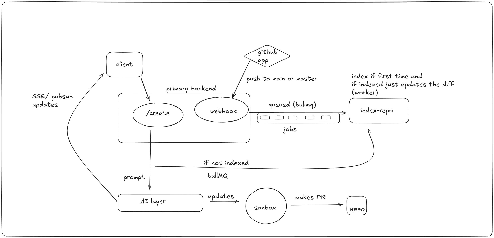

---
# Auto-Swe

An AI-powered automation system for processing Git repositories, generating PRs, and maintaining vectorized repo metadata for advanced analysis.
---

## High-level architecture



## **Features**

- **Repo Indexing**:
  - Automatically indexes repository metadata into **PGVector**.
  - Skips indexing if already present.

- **Automated PR Generation**:
  - Processes repositories using **LangGraph nodes**.
  - Creates Pull Requests based on AI-generated analysis or updates.

- **Incremental Updates**:
  - Watches `push` events to `main` or `master` branches.
  - Updates indexed data incrementally without reprocessing the whole repo.

- **Queue & Worker System**:
  - Uses **BullMQ** for background job management.
  - Supports scalable processing with multiple workers.

- **Sandboxed Execution**:
  - Runs code safely using **E2B sandbox**.

---

## **Tech Stack**

- **Language & Runtime**: [Bun](https://bun.sh/)
- **Monorepo Management**: Bun workspace
- **Database**: PostgreSQL + [PGVector](https://pgvector.io/) for embeddings
- **Queue System**: BullMQ
- **Sandboxing**: E2B
- **AI Processing**: LangGraph nodes for repo analysis

---

## **Getting Started**

### **Prerequisites**

- Bun installed (v1.x+)
- PostgreSQL with PGVector extension
- Redis (for BullMQ)
- Node-compatible environment for E2B sandbox

### **Installation**

```bash
# Clone the monorepo
git clone https://github.com/hemanth-1321/auto-swe
cd auto-swe

# Install dependencies using Bun
bun install
```

### **Environment Variables**

Create a `.env` file in the root with:

```env
MY_GITHUB_APP_ID=
MY_GITHUB_CLIENT_ID=
MY_GITHUB_CLIENT_SECRET=
MY_GITHUB_PRIVATE_KEY_PATH="./private-key.pem"
MY_GITHUB_WEBHOOK_SECRET=
HF_TOKEN=
REDIS_URL=
GROQ_API_KEY=
E2B_API_KEY=
PG_URL=
OPENAI_API_KEY=
DATABASE_URL=
JWT_SECRET=
```

## **Folder Structure**

```
/apps
  /worker         # BullMQ worker processing jobs
  /server            # API server for triggering repo jobs
  /web               #next js frontend
/packages
  /db             # PGVector integration
  /redis            #redis
  /shared        # github
```

---
